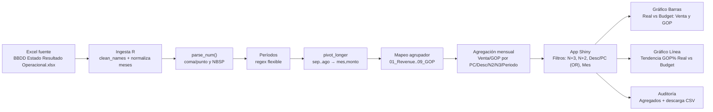

# Solution Card — Estado de Resultados (Budget_26 vs Real_26)

**Autor:** Castillo Rivas Benazir  
**Fecha:** `r format(Sys.Date(), '%Y-%m-%d')`  
**Proyecto:** App Shiny para comparar Venta y GOP (Real_26 vs Budget_26) y tendencia de GOP%.

## 1. Resumen
- **Propósito:** Comparar Venta y GOP entre **Budget_26** y **Real_26**, y visualizar la **tendencia de GOP%** con filtros (N+3, N+2, Descripción/PC, Mes fiscal Sep…Ago).
- **Usuarios:** Finanzas / Operaciones.
- **Entregable:** App **Shiny** + pestaña **Auditoría** y descarga CSV.

## 2. Datos
- **Fuente:** `BBDD Estado Resultado Operacional.xlsx` (junto al app).
- **Calendario fiscal:** Sep=1 … Ago=12.
- **Columnas clave:**
  - Periodo (`periodo`) → mapeado a `Budget_26`/`Real_26`/`Real_25` con regex flexible.
  - Identificadores: `pc`, `descripcion`, `n2`, `n3`.
  - Agrupador (`agrupador`) → estandarizado a `01_Revenue`…`09_GOP`.
  - Meses `sep..ago` (normalizados a minúscula).
  - `ytd`.

### 2.1 Limpieza y Transformación
1. `janitor::clean_names()`.  
2. Meses forzados a minúscula (`sep..ago`).  
3. **Parsing numérico robusto** (`parse_num`) para `1.234,56` / `1,234.56`.  
4. Regex flexible de periodos (`budget[_-]?26`, `real[_-]?26`, etc.).  
5. `pivot_longer(sep:ago)` → `(mes_txt, monto)` + `mes_num` / `mes_nombre`.  
6. Mapeo de `agrupador` a estándar (01…09).  
7. Cálculos:  
   - **Venta mensual** = Σ `monto` cuando `agrupador_std == "01_Revenue"`.  
   - **GOP mensual** = Σ `monto` cuando `agrupador_std == "09_GOP"`.  
   - **GOP% mensual (en gráficos)** = `(Σ GOP / Σ Venta)` por mes/periodo.

### 2.2 Supuestos y Limitaciones
- GOP usado = **declarado** (`09_GOP`), no recomputado desde 01–08 (salvo cambio de lógica).  
- Si falta `09_GOP` en una combinación, se asume 0 en la agregación.

## 3. Diagrama del Proceso (Mermaid)
